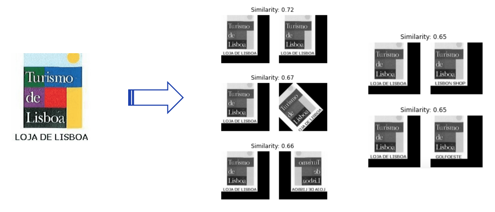

# Top 5 Brands Similarities

#### Final Project of the AI Course - Samsung Innovation Campus

When a new brand is registered, its image has to be different from all the others already registered.
Thus, the objective of this project is to show the **5 most similar brand images** from a database, comparing with the new brand to be registered.

To do that, we used *Siamese Neural Networks*:

To run this project you have to:
- Have a database with brand images
- Put the correct paths in `DataProcessing.ipynb` and follow the `Initial Instructions`
- Run `DataProcessing.ipynb`
- Put the correct paths in `Top5Similarities.ipynb`
- Run `Top5Similarities.ipynb`

In the end, you'll have a similar result to this:

Please read `report.pdf` if you want to know more about this project and *Siamese Neural Networks*.
